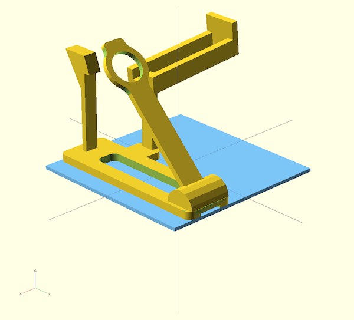
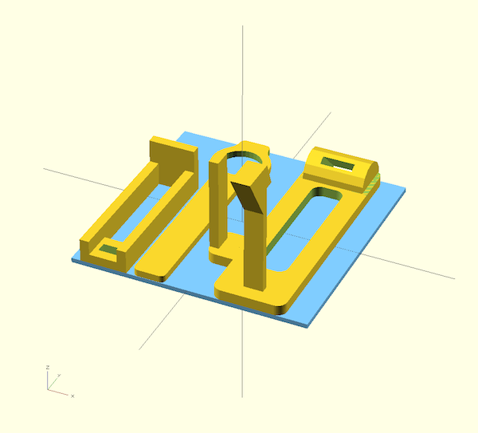

# Catapult

## Assignment

From the HCI2 course assignment by Patrick Baudisch (2014).

1. Design a catapult that shoots balls
2. Create a 3D model of it
3. Submit it so it can be printed

### Requirements

- No additional materials allowed, everything must be printed
- Trigger mechanism by pressing once on a "button" with a stylus
- Can load a magazine of min. 3 balls
- Next shot is loaded automatically
- Must stand on table, no holding when shooting
- Must fit into a max. volume of 125 cm³ (5 cm × 5 cm × 5 cm)
- Use max. 3 cm³ of material

### Munition (provided)

- Ø 10 mm ball
- Weight: 4.1 g

### Printing

- Printed with ABS on a Dimension Elite
- Layer resolution: 0.254 mm

### Tips

- Stiffness grows with thickness³
  ("… a plate's bending stiffness scales as its thickness cubed …",
  from <http://en.wikipedia.org/wiki/Material_selection>)
- Material properties of ABS:
  <http://www.makeitfrom.com/material-data/?for=Acrylonitrile-Butadiene-Styrene-ABS>

### Competition

The longest shot receives a prize (and lots of glory).
Measured as the euclidean distance between the front of the catapult
and the first hit on the ground (within the playfield).

### Workflow

1. Sketch the mechanical design of the catapult
   (include trigger mechanism, automatic reload, magazine;
   consider the size restriction)
2. 3D model the design
3. Upload sketches and 3D model (.stl) to the wiki
