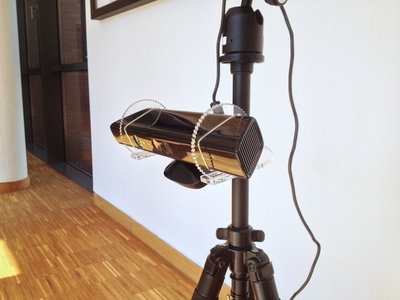
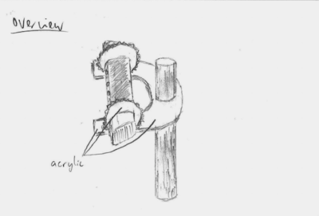
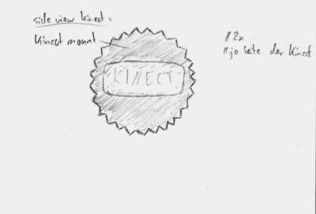
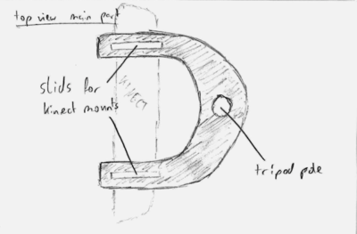
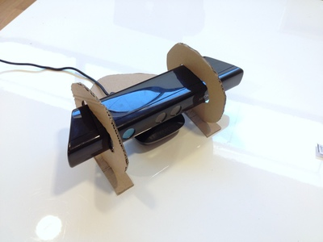
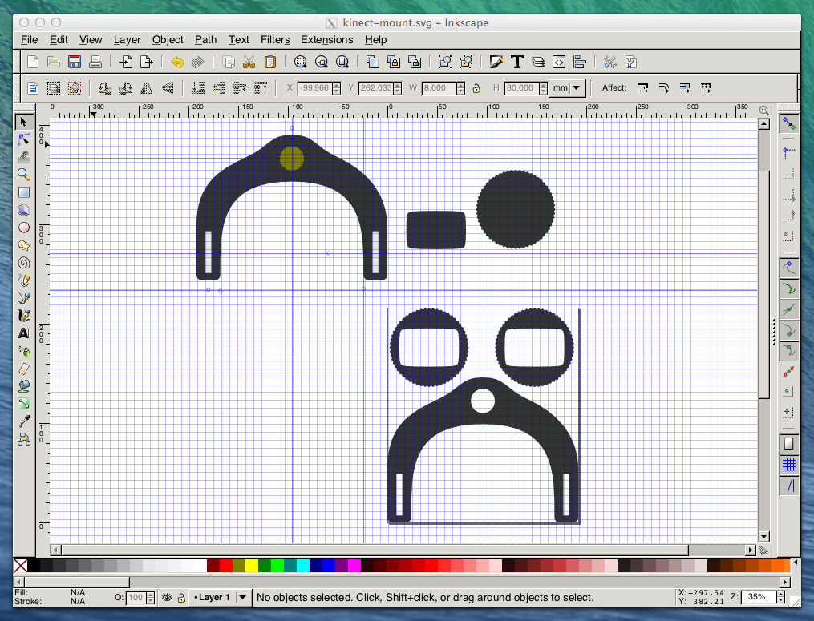
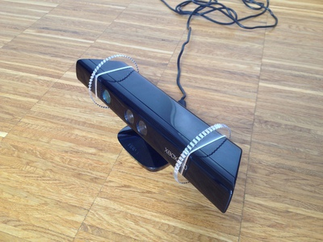
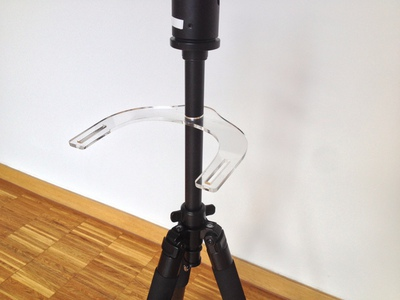
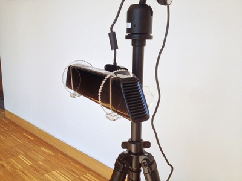

# Kinect Mount

This laser cut Kinect mount for tripods was created during the class "HCI2: Building Interactive Devices and Computer Vision" at the Hasso Plattner Institut.

Our task was to create a Kinect mount for tripods solely build with laser cut acrylic. Furthermore it should only be attached to the pole of the tripod and it should be height-adjustable.

## Sketches

This were our first sketches:

## Cardboard Prototype

Then we tried to build a first prototype with cardboard.

Due to the long arms, however, we couldn't test it at the pole.

### Design

Then we designed our final draft as a [SVG file](./kinect-mount.svg) with Inkscape and finally cut it with the laser cutter.

Due to the 60 teeth of the gear we are able to adjust the angle of the Kinect with an accuracy of 6˚.

